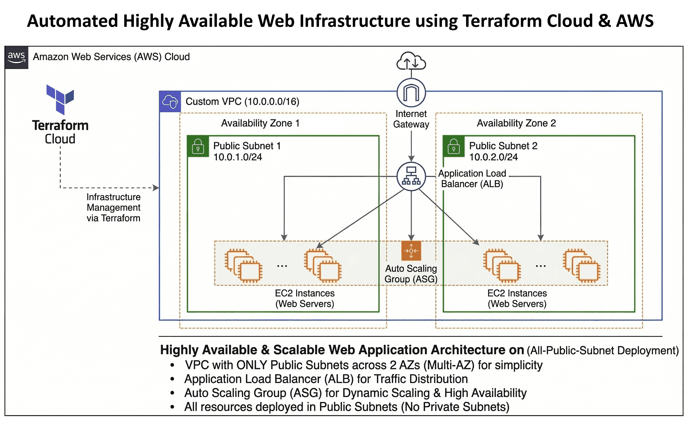

# 🌐 Automated Highly Available Web Infrastructure using Terraform Cloud & AWS

## 📋 Project Overview
This project demonstrates the automated provisioning of a highly available and production-ready cloud infrastructure on AWS using Terraform as Infrastructure as Code (IaC). The architecture deploys networking components, scalable compute resources, and load balancing mechanisms across multiple availability zones to ensure reliability, fault tolerance, and efficient traffic distribution. The objective was to gain hands-on experience with infrastructure automation, cloud networking, and scalable application deployment while following real-world DevOps practices used in enterprise environments.

## 🎥 Project Demonstration
Watch the full automated deployment and Terraform state management here:  
**[▶️ Watch Project Video on My Portfolio](https://waves.in/project05.html)** 

**Project Context:** Infrastructure as Code (IaC) Automation  
**Timeline:** 6 Weeks (Module Design & State Management)  
**Environment:** Automated Cloud Deployment (Terraform)  
**Core Tech Stack:** Terraform, Terraform Cloud, VPC, ALB, ASG, AWS EC2  

## 🎯 Objectives
- Implement Infrastructure as Code (IaC) using Terraform.
- Automate AWS infrastructure deployment.
- Build a scalable and highly available web hosting architecture.
- Implement automatic scaling of compute resources.
- Apply secure networking using custom VPC and security groups.
- Follow production-grade DevOps and cloud architecture practices.

## 🌍 Environment Details
- ☁️ **Cloud Provider:** AWS
- ☁️ **Infrastructure Automation Tool:** Terraform
- ☁️ **Architecture Type:** Highly Available Web Infrastructure
- ☁️ **Deployment Model:** Infrastructure as Code (IaC)
- ☁️ **Availability Design:** Multi Availability Zone Deployment
- ☁️ **Access Method:** HTTP/HTTPS through Load Balancer

## 🏗️ Architecture Diagram

## 🧱 Architecture Components
- 🏗️ **Virtual Private Cloud (VPC):**
  - Custom CIDR block configuration
  - Network isolation and segmentation
  - Controlled internet connectivity
- 🏗️ **Public Subnets:**
  - Internet-facing infrastructure
  - Route table connected to Internet Gateway
- 🏗️ **Internet Gateway:**
  - Provides public internet connectivity and routes incoming traffic to the ALB
- 🏗️ **Application Load Balancer (ALB):**
  - Layer 7 HTTP/HTTPS load balancing
  - Built-in health checks and fault tolerance
- 🏗️ **Auto Scaling Group (ASG):**
  - Dynamic scaling of compute resources
  - Automatic instance replacement based on traffic
- 🏗️ **EC2 Web Servers:**
  - Apache or NGINX web server automatically managed by Auto Scaling
- 🏗️ **Security Groups:**
  - Restrict unnecessary traffic and enforce least-privilege network access
- 🏗️ **Terraform (Infrastructure as Code):**
  - Automated AWS resource deployment
  - Reproducible and version-controlled infrastructure configuration

## 🔁 Traffic Flow
* **Inbound Traffic:** Users access the web application through the internet.
* **Routing:** Incoming traffic reaches the Application Load Balancer deployed in the public subnet.
* **Distribution:** The load balancer distributes requests across multiple EC2 instances.
* **Automation:** Terraform provisions and manages all infrastructure components automatically.

## 🔐 Security & Best Practices Implemented
- 🛡️ Infrastructure as Code utilizing modular Terraform configuration.
- 🛡️ Network isolation utilizing custom VPC architecture.
- 🛡️ High availability maintained across multiple availability zones.
- 🛡️ Auto-scaling implemented for seamless traffic demand management.
- 🛡️ Security groups strictly configured for controlled network access.

## 🧪 Validation & Testing
- [x] Verified Terraform initialization (`terraform init`) and deployment (`terraform apply`) process.
- [x] Tested successful provisioning of all infrastructure resources.
- [x] Confirmed load balancer traffic distribution.
- [x] Simulated load to observe Auto Scaling behavior.
- [x] Verified high availability across availability zones.

## 💡 Key Learnings & Why This Project Matters
Through this project, I gained practical experience designing scalable cloud infrastructure using Terraform and implementing Infrastructure as Code practices. I learned how to automate infrastructure deployment, manage cloud networking components, and design highly available architectures following core DevOps principles. 

This project demonstrates real-world DevOps and cloud engineering capabilities by automating the deployment of scalable and highly available infrastructure. It reflects industry best practices for IaC, automation, and cloud architecture used in modern production environments.
